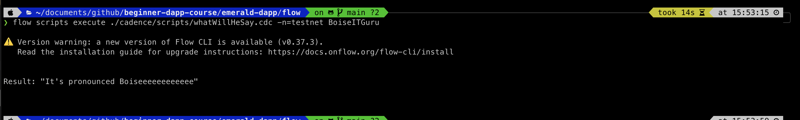

# Chapter 1 
## Chapter 1 Day 1

### Question 1
1. Explain what the Blockchain is in your own words. You can read this to help you, but you don't have to: https://www.investopedia.com/terms/b/blockchain.asp

### Answer 1 
Blockchain is an open, public, decentralized ledger and data base that everyone can store , read and interact with it in certain way. 
The uniqueness of the blockchain is that it is build on consensus, no personel can change / alter the data without the majority agreeing. 

### Question 2
2. Explain what a Smart Contract is. You can read this to help you, but you don't have to: https://www.ibm.com/topics/smart-contracts

### Answer 2
Smart Contract is the rule book of how user can interact with the blockchain in a certain way. 
Users can only interact with the blockchain in the way the rule book (smart contract) is written.

### Question 3
3. Explain the difference between a script and a transaction.

### Answer 3
Transaction : alter chain state, cost gas
Script : read chain state, free :P 


## Chapter 1 Day 2
No quest for today yeah! 


# Chapter 2 
## Chapter 2 Day 1

### Question 1 
1. What is the difference between frontend and backend? Can you provide a real life example (you can't use the one in this chapter)?

### Answer 1 
Frontend takes care of what the users see and styling, provide good UX to the user when they browse the web / app
Backend takes care of the data and logic behind the scene, when user click on a button, how the data is being handled / fetched effectively.

In .find, frontend is the beautiful find.xyz web (Yeah I am advertising here :P)
and the backend is supported by the powerful , amazing , marvellous flow blockchain!!! All the logics for buying names, sending funds are handled by the smart contracts on flow blockchain. 

### Question 2 
2. What is the difference between global styling and module styling?

### Answer 2 
Global Styling applies globally (literally what that means)
Module styling modifies the styling of a component when the developer imports the file the module is defined and `style` it

### Question 3 
3. Take a screenshot of the running application and upload it to your quest submissions.

### Answer 3


### Question 4 
4. Upload the link to your public GitHub repository.

### Answer 4
https://github.com/Bamthelearner/beginner-dapp-course/tree/main/


## Chapter 2 Day 2
### Questions
1. Change the color of "Emerald DApp" to whatever color you want
2. Change the font size of the title
3. Change the "Emerald DApp" link to a different link (this means messing with the `<a>` tag)
4. Inside of your `<main>` tag, add a `<p>` tag and put whatever text you want in it. The box model will look like this:
5. Go to the `.main` class and add this line: `flex-direction: column`. Watch what it does!

### Answer 


## Chapter 2 Day 3 
### Question 1 

1. In this part, we will be adding another button and changing up some styling.
- Wrap the `<button>` tag we added inside of a `<div>`. Add a `className` called `styles.flex` to that `<div>`. Make sure the `<button>` is inside of it.
- Then, add another `<button>` inside the `<div>` tag and put "Goodbye" inside of it.
- In `./styles/Home.module.css`, add a new style for the "flex" class, and inside of it, add one line: `display: flex`.

### Answer 1 


### Question 2 
2. Now we're going to add an action to your new button.
- To your second button, add an `onClick` handler and call a function named `printGoodbye`.
- Define a new function called `printGoodbye` under the `printHello` function
- Make it `console.log` "Goodbye"

### Answer 2 


## Chapter 2 Day 4 
### Question 
1. Change the `printHello` function to be called `runTransaction`. 
2. Change the "Hello" text inside the button to "Run Transaction".
3. Inside the `runTransaction` function, add some code to console log your `newGreeting` variable to the developer console.
4. Go back to your webpage, type something into the input box, and press "Hello". Open your developer console and you will see some thing being printed! 

### Answer 


```javascript
import Head from 'next/head'
import styles from '../styles/Home.module.css'
import Nav from '../components/Nav.jsx'
import { useState } from 'react';

export default function Home() {

  const [newGreeting, setNewGreeting] = useState('');

  function runTransaction() {
    console.log(newGreeting)
  }

  // function printGoodbye() {
  //   console.log("Bye gonna take some rest. ")
  // }

  return (
    <div className={styles.container}>
      <Head>
        <title>Emerald DApp</title>
        <meta name="description" content="Created by Emerald Academy" />
        <link rel="icon" href="https://i.imgur.com/hvNtbgD.png" />
      </Head>

      <Nav />

      <main className={styles.main}>
        <h1 className={styles.title}>
          Welcome to my <a href="https://www.youtube.com/channel/UCf6DzMRwj7SJ3nPrZqd5hHw" target="_blank">Emerald DApp!</a>
        </h1>
        <p className={styles.p}>
          If I were you, I won't click on that link :P
        </p>
        <div>
          <button onClick={runTransaction}>Run Transaction</button>
          <input onChange={(e) => setNewGreeting(e.target.value)} placeholder="Hello, Genius!" />
        </div>
      </main>
    </div >
  )
}
```


# Chapter 3 
## Chapter 3 Day 1 
### Questions 
1. Deploy a contract to account `0x03` called "JacobTucker". Inside that contract, declare a **constant** variable named `is`, and make it have type `String`. Initialize it to "the best" when your contract gets deployed.

2. Check that your variable `is` actually equals "the best" by executing a script to read that variable. Include a screenshot of the output.

### Answer 
Contract 
```cadence
pub contract JacobTucker {
    pub let is : String 

    init(){
        self.is = "the best (maybe :P )"
    }
}
``` 

Script 
```cadence
import JacobTucker from 0x03 

pub fun main() : String {
    return JacobTucker.is
}
// Trust me it will return "the best"
```


## Chapter 3 Day 2 
### Question 1
1. Explain why we wouldn't call `changeGreeting` in a script.

### Answer 1
`changeGreeting` includes action to change the state of the blockchain. Scripts are not meant to alter the state of blockchain.

### Question 2 
2. What does the `AuthAccount` mean in the `prepare` phase of the transaction?

### Answer 2
It means the signing account of the transaction. (can be more than 1) We can access the Account storage data and alter that in prepare phase.

### Question 3 
3. What is the difference between the `prepare` phase and the `execute` phase in the transaction?

### Answer 3 
prepare phase meant to get access to signing account storage. 
execute phase does not allow accessing data to account storage, and meant to execute the logic / action of the transaction.

### Question 4 
4. This is the hardest quest so far, so if it takes you some time, do not worry! I can help you in the Discord if you have questions.

- Add two new things inside your contract:
    - A variable named `myNumber` that has type `Int` (set it to 0 when the contract is deployed)
    - A function named `updateMyNumber` that takes in a new number named `newNumber` as a parameter that has type `Int` and updates `myNumber` to be `newNumber`

- Add a script that reads `myNumber` from the contract

- Add a transaction that takes in a parameter named `myNewNumber` and passes it into the `updateMyNumber` function. Verify that your number changed by running the script again.

### Answer 4 
OK I don't know this question, please help me (Just kidding!)

Contract 
```cadence
pub contract HelloWorld {

    pub var greeting: String
    pub var myNumber : Int

    pub fun changeGreeting(newGreeting: String) {
        self.greeting = newGreeting
    }

    pub fun updateMyNumber(newNumber : Int) {
        self.myNumber = newNumber
    }

    init() {
        self.greeting = "Hello, World!"
        self.myNumber = 0
    }
}
```

Transaction
```cadence
import HelloWorld from 0x01 

transaction(newNumber : Int) {
    prepare(account : AuthAccount) {

    }

    execute{
        HelloWorld.updateMyNumber(newNumber: newNumber)
    }
}
```

Script 
```cadence 
import HelloWorld from 0x01 

pub fun main() : Int {
    return HellowWorld.myNumber
}
```


## Chapter 3 Day 3

### Questions 
1. Create a new smart contract in Cadence that has at least the following two things:
- A variable to hold a value (like a number or a piece of text)
- A function to change that variable

After, deploy that contract to the same testnet account you generated today.

2. Send a screenshot of you reading the variable from your new contract using the Flow CLI
3. Send a screenshot of you changing the variable from your new contract using the Flow CLI
4. Send a screenshot of you reading your changed variable from your new contract using the Flow CLI
5. Go to https://flow-view-source.com/testnet/. Where it says "Account", paste in the Flow address you generated and click "Go". On the left hand side, you should see your "HelloWorld" contract and your new contract. Isn't it so cool to see them live on Testnet? Then, send the URL to the page. 

### Answers 



https://flow-view-source.com/testnet/account/0xc516ecbec2e88547


# Chapter 4 
## Chapter 4 Day 1 
### Questions 
1. How did we get the address of the user? Please explain in words and then in code.
2. What do `fcl.authenticate` and `fcl.unauthenticate` do?
3. Why did we make a `config.js` file? What does it do?
4. What does our `useEffect` do?
5. How do we import FCL?
6. What does `fcl.currentUser.subscribe(setUser);` do?

### Question 
1. How did we get the address of the user? Please explain in words and then in code.

### Answer
1. When users log in with fcl pop up window, the user is set to subscribe to a certain user in fcl and get sent to user variable. 
the user.addr is registered with the user address. 

When the user click login
```javascript
<button onClick={handleAuthentication}>{user.loggedIn ? user.addr : "Log In"}</button>
```

This function runs ( with user.loggedIn = false )

```javascript
    function handleAuthentication() {
        if (user.loggedIn) {
            fcl.unauthenticate(); // logs the user out
        } else {
            fcl.authenticate(); // logs the user in
        }
    }
```

In authenticate, the currentUser is set to whatever account logged to fcl.
Therefore this function is called. 

```javascript
fcl.authenticate() 
```

The page is updated so useEffect will run with fcl to setUser with the latest user info.
```javascript
    useEffect(() => {
        fcl.currentUser.subscribe(setUser);
    }, [])
```

### Question 
2. What do `fcl.authenticate` and `fcl.unauthenticate` do?

### Answer 
2. 
`fcl.authenticate` sets the fcl.currentUser to the account that logs into the pop up window
`fcl.unauthenticate` reset fcl.currentUser to none. 


### Question 
3. Why did we make a `config.js` file? What does it do?

### Answer 
3. 
`config.js` is a config file for fcl. It tells fcl on what network and node it should use (for example : emulator, testnet, mainnet)

### Question 
4. What does our `useEffect` do?

### Answer 
4. 
UseEffect keeps checking whether the user logged in / out their accounts and keep the states of what they orginally is between each refresh.
```javascript
    useEffect(() => {
        fcl.currentUser.subscribe(setUser);
    }, [])
```

### Question 
5. How do we import FCL?

### Answer 
5. 
```javascript
import * as fcl from "@onflow/fcl";
import "../flow/config.js";
```

### Question 
6. What does `fcl.currentUser.subscribe(setUser);` do?

### Answer 
6. Not really sure, but I guess it setUser with fcl.currentUser? 


## Chapter 4 Day 2

### Question

1. Instead of console logging the result after the script executes, I want you to:
- Make a new variable named `greeting` using `useState`
- Set the `greeting` variable to the `response` of the script call
- Create a `<p>` tag after the `<div className={styles.flex}>` tag
- Put the `greeting` variable inside of that `<p>` tag. This will make the result of your script show on your webpage! It should look something 

### Answer


### Question 
2a. I deployed a contract called `SimpleTest` to an account with an address of `0x6c0d53c676256e8c`. I want you to make a button that, when clicked, executes a script to read the `number` variable from that contract. If you're curious, you can see the contract here: https://flow-view-source.com/testnet/account/0x6c0d53c676256e8c/contract/SimpleTest

Submit all the code you used to call the script, and the result of the script.

2b. Then, I want you to remove the button, and make the script execute every time the page refreshes.

Submit all the code you used to do this.

### Answer 
2a. 
``` javascript
import Head from 'next/head'
import styles from '../styles/Home.module.css'
import Nav from '../components/Nav.jsx';
import { useState, useEffect } from 'react';
import * as fcl from "@onflow/fcl";
import "../flow/config.js";


export default function Home() {
  const [newGreeting, setNewGreeting] = useState('');
  const [greeting, setGreeting] = useState('');
  const [number, setNumber] = useState('');

  function runTransaction() {
    console.log("Running transaction!");
    console.log("Changing the greeting to: " + newGreeting);
  }

  async function executeScript() {
    const response = await fcl.query({
      cadence: `
      import HelloWorld from 0xc516ecbec2e88547 
  
      pub fun main(): String {
          return HelloWorld.greeting
      }
      `,
      args: (arg, t) => [] // ARGUMENTS GO IN HERE
    })

    console.log("Response from our script: " + response);
    setGreeting(response)
  }

  async function executeNumberScript() {
    const response = await fcl.query({
      cadence: `
      import SimpleTest from 0x6c0d53c676256e8c 
  
      pub fun main(): Int {
          return SimpleTest.number
      }
      `,
      args: (arg, t) => [] // ARGUMENTS GO IN HERE
    })

    setNumber(response)
  }

  useEffect(() => {
    executeScript()
  }, [])

  return (
    <div>
      <Head>
        <title>Emerald DApp</title>
        <meta name="description" content="Created by Emerald Academy" />
        <link rel="icon" href="https://i.imgur.com/hvNtbgD.png" />
      </Head>

      <Nav />

      <main className={styles.main}>
        <h1 className={styles.title}>
          Welcome to my <a href="https://academy.ecdao.org" target="_blank">Emerald DApp!</a>
        </h1>
        <p>This is a DApp created by Jacob Tucker.</p>

        <div className={styles.flex}>
          <p>{greeting}</p>
          <button onClick={runTransaction}>Run Transaction</button>
          <input onChange={(e) => setNewGreeting(e.target.value)} placeholder="Hello, Idiots!" />
        </div>

        <div>
          <button onClick={executeNumberScript}>Check number</button>
          <p>{number}</p>
        </div>

      </main>
    </div>
  )
}
```

2b. 
```javascript
import Head from 'next/head'
import styles from '../styles/Home.module.css'
import Nav from '../components/Nav.jsx';
import { useState, useEffect } from 'react';
import * as fcl from "@onflow/fcl";
import "../flow/config.js";


export default function Home() {
  const [newGreeting, setNewGreeting] = useState('');
  const [greeting, setGreeting] = useState('');
  const [number, setNumber] = useState('');

  function runTransaction() {
    console.log("Running transaction!");
    console.log("Changing the greeting to: " + newGreeting);
  }

  async function executeScript() {
    const response = await fcl.query({
      cadence: `
      import HelloWorld from 0xc516ecbec2e88547 
  
      pub fun main(): String {
          return HelloWorld.greeting
      }
      `,
      args: (arg, t) => [] // ARGUMENTS GO IN HERE
    })

    console.log("Response from our script: " + response);
    setGreeting(response)
  }

  async function executeNumberScript() {
    const response = await fcl.query({
      cadence: `
      import SimpleTest from 0x6c0d53c676256e8c 
  
      pub fun main(): Int {
          return SimpleTest.number
      }
      `,
      args: (arg, t) => [] // ARGUMENTS GO IN HERE
    })

    setNumber(response)
  }

  useEffect(() => {
    executeScript()
    executeNumberScript()
  }, [])

  return (
    <div>
      <Head>
        <title>Emerald DApp</title>
        <meta name="description" content="Created by Emerald Academy" />
        <link rel="icon" href="https://i.imgur.com/hvNtbgD.png" />
      </Head>

      <Nav />

      <main className={styles.main}>
        <h1 className={styles.title}>
          Welcome to my <a href="https://academy.ecdao.org" target="_blank">Emerald DApp!</a>
        </h1>
        <p>This is a DApp created by Jacob Tucker.</p>

        <div className={styles.flex}>
          <p>{greeting}</p>
          <button onClick={runTransaction}>Run Transaction</button>
          <input onChange={(e) => setNewGreeting(e.target.value)} placeholder="Hello, Idiots!" />
        </div>

        <div>
          <button onClick={executeNumberScript}>Check number</button>
          <p> {number == '' ? "There is no number" : "The number is " + number}</p>
        </div>

      </main>
    </div>
  )
}
```


## Chapter 4 Day 3
### Question 

1. Write a function that executes a script with all the Cadence types that we reviewed today. Call the script when the page refreshes. Return something random from the Cadence script, and console log it to prove to me your script actually worked.

### Answer


## Chapter 4 Day 4
### Question

1. I deployed a contract called `SimpleTest` to an account with an address of `0x6c0d53c676256e8c`. I want you to make a button that, when clicked, sends a transaction to change the `number` variable from that contract. If you're curious, you can see the contract here: https://flow-view-source.com/testnet/account/0x6c0d53c676256e8c/contract/SimpleTest

2. Immediately after you send the transaction, wait for the transaction to be "Sealed" just like we did today. Then, call a script to read the `number` from the contract. Console log the result.

Submit all the code you used to send the transaction, and the result of the script.

### Answer 
```javascript
import Head from 'next/head'
import styles from '../styles/Home.module.css'
import Nav from '../components/Nav.jsx';
import { useState, useEffect } from 'react';
import * as fcl from "@onflow/fcl";
import "../flow/config.js";


export default function Home() {
  const [newGreeting, setNewGreeting] = useState('');
  const [greeting, setGreeting] = useState('');
  const [number, setNumber] = useState('');
  const [numberInput, setNumberInput] = useState('');

  async function executeScript() {
    const response = await fcl.query({
      cadence: `
      import HelloWorld from 0xc516ecbec2e88547 
  
      pub fun main(): String {
          return HelloWorld.greeting
      }
      `,
      args: (arg, t) => [] // ARGUMENTS GO IN HERE
    })

    console.log("Response from our script: " + response);
    setGreeting(response)
  }

  async function executeNumberScript() {
    const response = await fcl.query({
      cadence: `
      import SimpleTest from 0x6c0d53c676256e8c 
  
      pub fun main(): Int {
          return SimpleTest.number
      }
      `,
      args: (arg, t) => [] // ARGUMENTS GO IN HERE
    })

    setNumber(response)
  }

  useEffect(() => {
    executeScript()
    executeNumberScript()
  }, [])

  async function runTransaction() {
    const transactionId = await fcl.mutate({
      cadence: `
      import HelloWorld from 0xc516ecbec2e88547
  
      transaction(myNewGreeting: String) {
  
        prepare(signer: AuthAccount) {}
  
        execute {
          HelloWorld.changeGreeting(newGreeting: myNewGreeting)
        }
      }
      `,
      args: (arg, t) => [
        arg(newGreeting, t.String)
      ],
      proposer: fcl.authz,
      payer: fcl.authz,
      authorizations: [fcl.authz],
      limit: 999
    })

    await fcl.tx(transactionId).onceSealed();
    executeScript();
    console.log("Here is the transactionId: " + transactionId);
  }

  async function runNumberTransaction() {
    const transactionId = await fcl.mutate({
      cadence: `
      import SimpleTest from 0x6c0d53c676256e8c
  
      transaction(number: Int) {
  
        prepare(signer: AuthAccount) {}
  
        execute {
          SimpleTest.updateNumber(newNumber: number)
        }
      }
      `,
      args: (arg, t) => [
        arg(numberInput, t.Int)
      ],
      proposer: fcl.authz,
      payer: fcl.authz,
      authorizations: [fcl.authz],
      limit: 999
    })

    await fcl.tx(transactionId).onceSealed();
    executeNumberScript();
    console.log("Here is the transactionId: " + transactionId);
  }

  return (
    <div>
      <Head>
        <title>Emerald DApp</title>
        <meta name="description" content="Created by Emerald Academy" />
        <link rel="icon" href="https://i.imgur.com/hvNtbgD.png" />
      </Head>

      <Nav />

      <main className={styles.main}>
        <h1 className={styles.title}>
          Welcome to my <a href="https://academy.ecdao.org" target="_blank">Emerald DApp!</a>
        </h1>
        <p>This is a DApp created by Jacob Tucker.</p>

        <div className={styles.flex}>
          <p>{greeting}</p>
          <button onClick={runTransaction}>Run Transaction</button>
          <input onChange={(e) => setNewGreeting(e.target.value)} placeholder="Hello, Idiots!" />
        </div>

        <div className={styles.flex}>
          <p> {number == '' ? "There is no number" : "The number is " + number}</p>
          <input onChange={(e) => setNumberInput(e.target.value)} placeholder="0" />
          <button onClick={runNumberTransaction}>Change the number </button>
        </div>

        <div>
          <button onClick={executeNumberScript}>Check number</button>
        </div>

      </main>
    </div>
  )
}
```


# Chaper 5
## Chapter 5 Day 1

### Question
1. List all the possible transaction status codes and what each of them mean.

### Answer 
0 and 1 : pending
2 : finalizing
3 : executing
4 : sealed

### Question
2a. What does setTimeout do? 
2b. How would we change our code if we wanted the `txStatus` variable to reset back to its original state after 5 seconds?

### Answer 
2a. setTimeout reset the txStatus back to 'Run Transaction' after it gets changed to "Sealed" for 2s.
2b. 
```javascript
setTimeout(() => setTxStatus('Run Transaction'), 5000); // We added this line
```

### Question
3. What does the `fcl.tx(transactionId).subscribe(res => {...})` function do?

### Answer 
subscribe (update when there is change) the transaction status of transactionId to txStatus variable. 

### Question
4. Make at least 3 changes to the styling of the application. It can be anything (part of this quest is being creative!). List the 3 changes and point them out in a screenshot.

### Answer 


# THE LAST ONE! 
https://beginner-dapp-course-369ofi8lc-bamthelearner.vercel.app/
No gonna make any tags or formatting or whatever :P